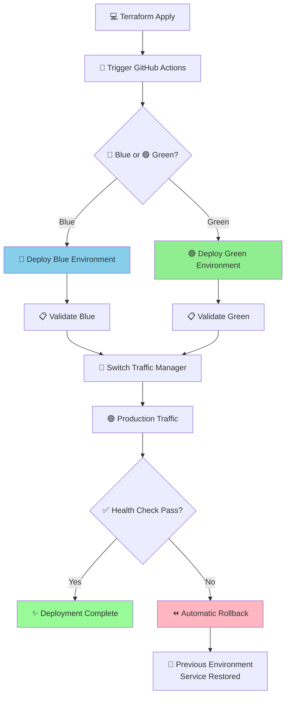
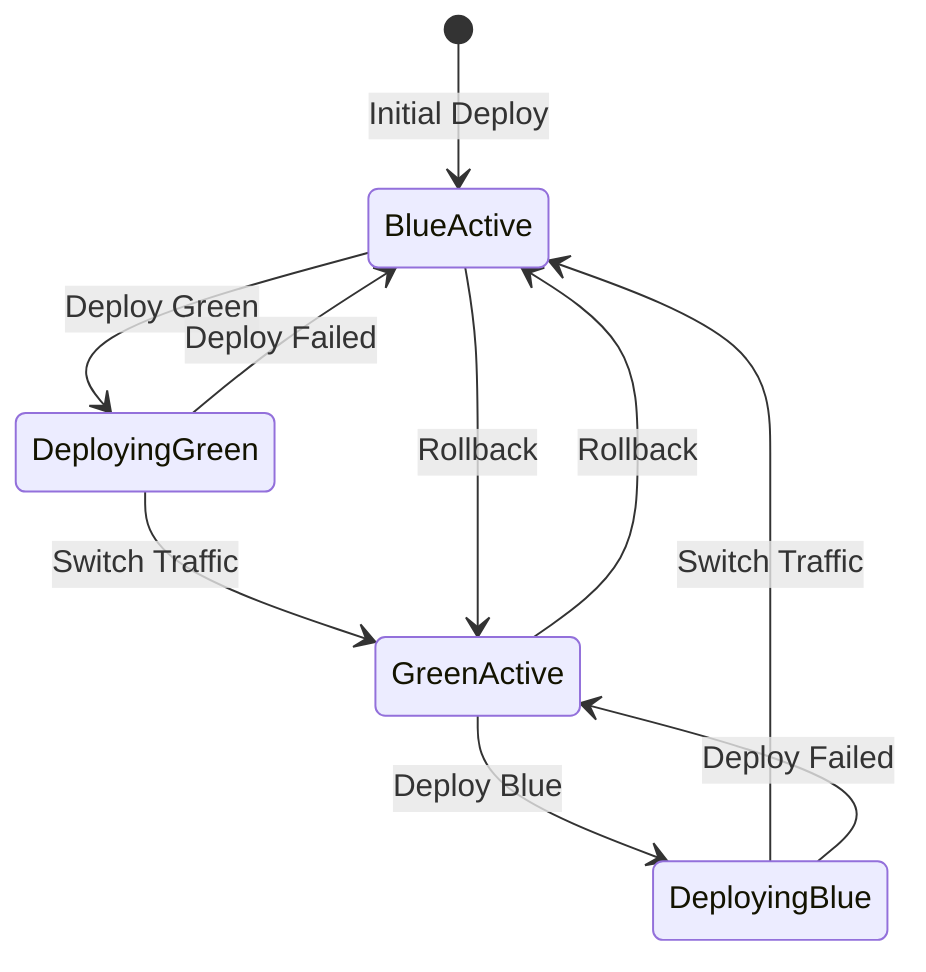

# 🚀 DevOps Blue-Green Deployment Pipeline

## 🌍 Overview
Terraform-orchestrated blue-green deployment pipeline with zero-downtime deployments, automated testing, and instant rollback capabilities.

## 🏗️ Architecture Components

### 🔄 **Blue-Green Deployment**
- **Zero Downtime**: Seamless environment switching
- **Instant Rollback**: One-click rollback to previous version
- **Health Checks**: Automated validation before traffic switch
- **Terraform Orchestration**: Infrastructure-driven deployments

### 🛠️ **Infrastructure as Code**
- **Terraform**: Primary orchestration (`terraform/main.tf`)
- **Bicep**: Azure resource templates (`infrastructure/main.bicep`)
- **Docker**: Local development environment
- **GitHub Actions**: Automated CI/CD workflows

## 🔧 One-Click Deployment Setup

### 1. 🔑 Configure Terraform Variables
```bash
# Copy example file
cp terraform/terraform.tfvars.example terraform/terraform.tfvars

# Edit with your values
target_environment = "blue"
trigger_deployment = true
switch_traffic     = true
github_token      = "ghp_xxxxxxxxxxxxxxxxxxxx"
github_repo       = "your-username/sql-data-analytics-project"
```

### 2. 🚀 Deploy with One Command
```bash
# Deploy to blue environment
./deploy.sh blue deploy

# Switch traffic to green
./deploy.sh green switch

# Rollback if needed
./deploy.sh blue rollback
```

### 3. 💻 Local Development
```bash
# Start local environment
docker-compose up -d

# Access SQL Server
docker exec -it sql-analytics-db /opt/mssql-tools/bin/sqlcmd -S localhost -U sa
```

## 📊 Pipeline Stages

1. **Validate** → SQL scripts, CSV files
2. **Deploy Infrastructure** → Azure resources
3. **Deploy Database** → Schemas, data loading
4. **Test** → Data quality validation
5. **Monitor** → Performance metrics

## 🧪 Testing Strategy

- **Unit Tests**: SQL script validation
- **Integration Tests**: Data consistency checks
- **Performance Tests**: Query optimization
- **Security Tests**: Access control validation

## 🔄 Blue-Green Deployment Flow



## 🔍 Deployment States



## 📈 Monitoring & Alerts

- Database performance metrics
- Data quality dashboards
- Pipeline failure notifications
- Resource utilization tracking