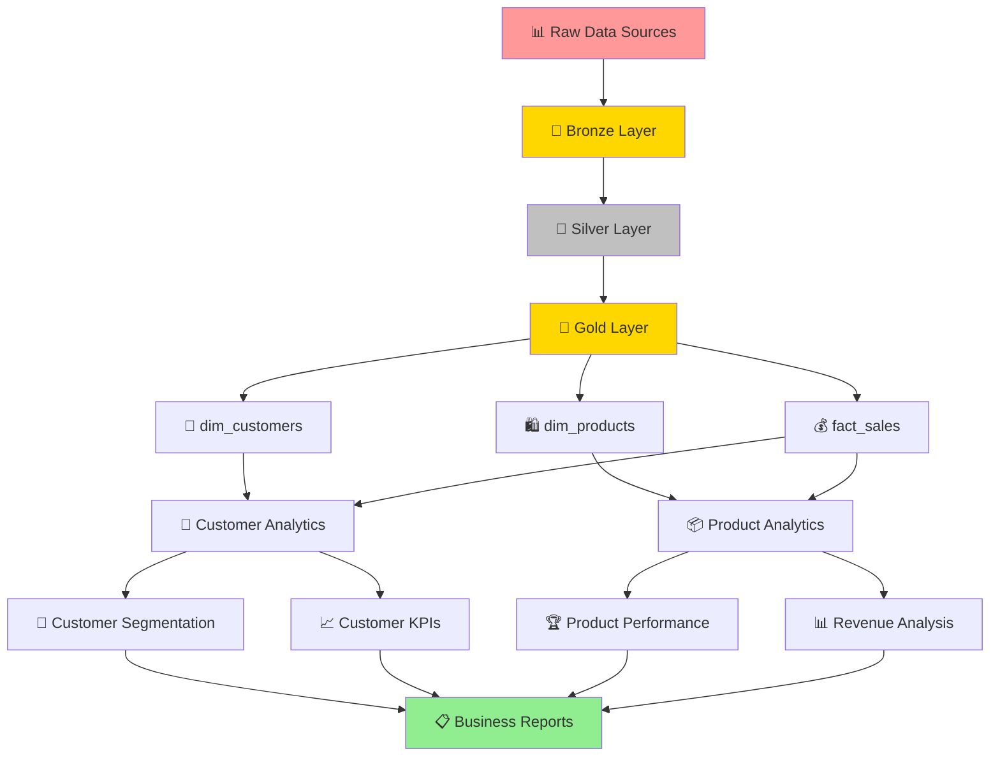

# 📊 SQL Data Analytics Project

A comprehensive collection of SQL scripts for data exploration, analytics, and reporting using a data warehouse architecture. This project demonstrates end-to-end data analytics workflows from database initialization to advanced reporting.

## 🎯 Overview

This repository contains SQL queries designed to help data analysts and BI professionals quickly explore, segment, and analyze data within a relational database. Each script focuses on a specific analytical theme and demonstrates best practices for SQL queries using a **Bronze-Silver-Gold** data architecture.

## 🏗️ Architecture

The project follows a modern data warehouse pattern:
- **🥉 Bronze Layer**: Raw data ingestion
- **🥈 Silver Layer**: Cleaned and transformed data
- **🥇 Gold Layer**: Business-ready dimensional model



### 📋 Database Schema
- `gold.dim_customers` - Customer dimension table
- `gold.dim_products` - Product dimension table  
- `gold.fact_sales` - Sales fact table
- `gold.report_customers` - Customer analytics view
- `gold.report_products` - Product analytics view

## 📁 Project Structure

```
📦 sql-data-analytics-project/
├── 📂 datasets/
│   ├── 📂 csv-files/           # Sample data files (Bronze, Silver, Gold)
│   └── 📄 DataWarehouseAnalytics.bak
├── 📂 scripts/
│   ├── 🔧 00_init_database.sql
│   ├── 🔍 01_database_exploration.sql
│   ├── 📐 02_dimensions_exploration.sql
│   ├── 📅 03_date_range_exploration.sql
│   ├── 📊 04_measures_exploration.sql
│   ├── 📈 05_magnitude_analysis.sql
│   ├── 🏆 06_ranking_analysis.sql
│   ├── ⏰ 07_change_over_time_analysis.sql
│   ├── 📈 08_cumulative_analysis.sql
│   ├── ⚡ 09_performance_analysis.sql
│   ├── 🎯 10_data_segmentation.sql
│   ├── 🥧 11_part_to_whole_analysis.sql
│   ├── 👥 12_report_customers.sql
│   └── 🛍️ 13_report_products.sql
├── 📂 docs/
├── 📄 LICENSE
└── 📖 README.md
```

## 🚀 Getting Started

### Prerequisites
- SQL Server (2019 or later recommended)
- SQL Server Management Studio (SSMS) or Azure Data Studio
- Sample datasets (included in `/datasets/csv-files/`)

### 🔧 Setup Instructions

1. **Initialize Database**
   ```sql
   -- Run the initialization script
   -- ⚠️ WARNING: This will drop existing 'DataWarehouseAnalytics' database
   EXEC scripts/00_init_database.sql
   ```

2. **Load Sample Data**
   - Update file paths in `00_init_database.sql` to match your CSV file locations
   - Execute the script to create tables and load data

3. **Run Analysis Scripts**
   - Execute scripts in numerical order (01-13)
   - Each script is self-contained and documented

## 📊 Analysis Categories

### 🔍 **Exploratory Analysis**
| Script | Purpose | Key Functions |
|--------|---------|---------------|
| `01_database_exploration.sql` | Database structure discovery | `INFORMATION_SCHEMA` |
| `02_dimensions_exploration.sql` | Dimension table analysis | `DISTINCT`, `ORDER BY` |
| `03_date_range_exploration.sql` | Date range analysis | Date functions |

### 📈 **Metrics & KPIs**
| Script | Purpose | Key Functions |
|--------|---------|---------------|
| `04_measures_exploration.sql` | Key business metrics | `SUM()`, `COUNT()`, `AVG()` |
| `05_magnitude_analysis.sql` | Data magnitude analysis | Aggregate functions |
| `06_ranking_analysis.sql` | Ranking and top performers | `ROW_NUMBER()`, `RANK()` |

### ⏰ **Time-Based Analysis**
| Script | Purpose | Key Functions |
|--------|---------|---------------|
| `07_change_over_time_analysis.sql` | Trend analysis | `DATEPART()`, `DATETRUNC()` |
| `08_cumulative_analysis.sql` | Running totals | Window functions |
| `09_performance_analysis.sql` | Performance metrics | Advanced aggregations |

### 🎯 **Advanced Analytics**
| Script | Purpose | Key Functions |
|--------|---------|---------------|
| `10_data_segmentation.sql` | Customer/Product segmentation | `CASE`, `CTE` |
| `11_part_to_whole_analysis.sql` | Percentage analysis | Ratio calculations |

### 📋 **Business Reports**
| Script | Purpose | Output |
|--------|---------|--------|
| `12_report_customers.sql` | Customer analytics view | Customer segments, KPIs |
| `13_report_products.sql` | Product analytics view | Product performance metrics |

## 🎯 Key Features

- ✅ **Complete Data Pipeline**: From raw data to business insights
- ✅ **Best Practices**: Well-documented, modular SQL code
- ✅ **Real-World Scenarios**: Customer segmentation, product analysis, time-series
- ✅ **Advanced SQL**: CTEs, Window functions, Complex joins
- ✅ **Business Intelligence**: KPI calculations, performance metrics
- ✅ **Scalable Architecture**: Bronze-Silver-Gold pattern

## 📊 Sample Insights

The scripts help answer business questions like:
- 💰 What are our total sales and key metrics?
- 👥 How do we segment customers (VIP, Regular, New)?
- 🛍️ Which products are top performers?
- 📈 What are our sales trends over time?
- 🎯 What's our customer lifetime value?
- 📊 How do different segments contribute to revenue?

## 🤝 Contributing

Contributions are welcome! Please feel free to submit a Pull Request. For major changes, please open an issue first to discuss what you would like to change.

## 🛡️ License

This project is licensed under the [MIT License](LICENSE). You are free to use, modify, and share this project with proper attribution.

---

⭐ **Star this repository if you find it helpful!** ⭐
