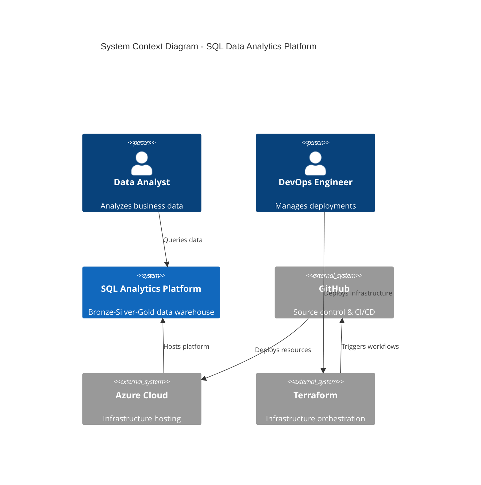
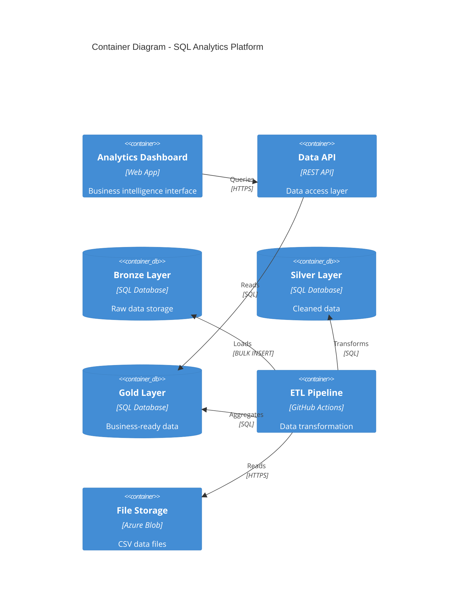
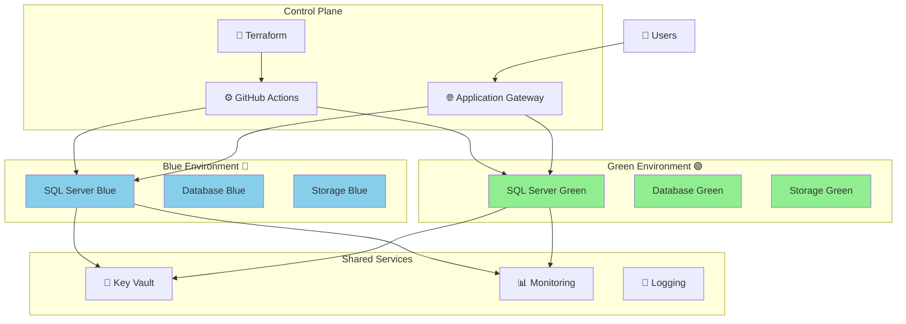
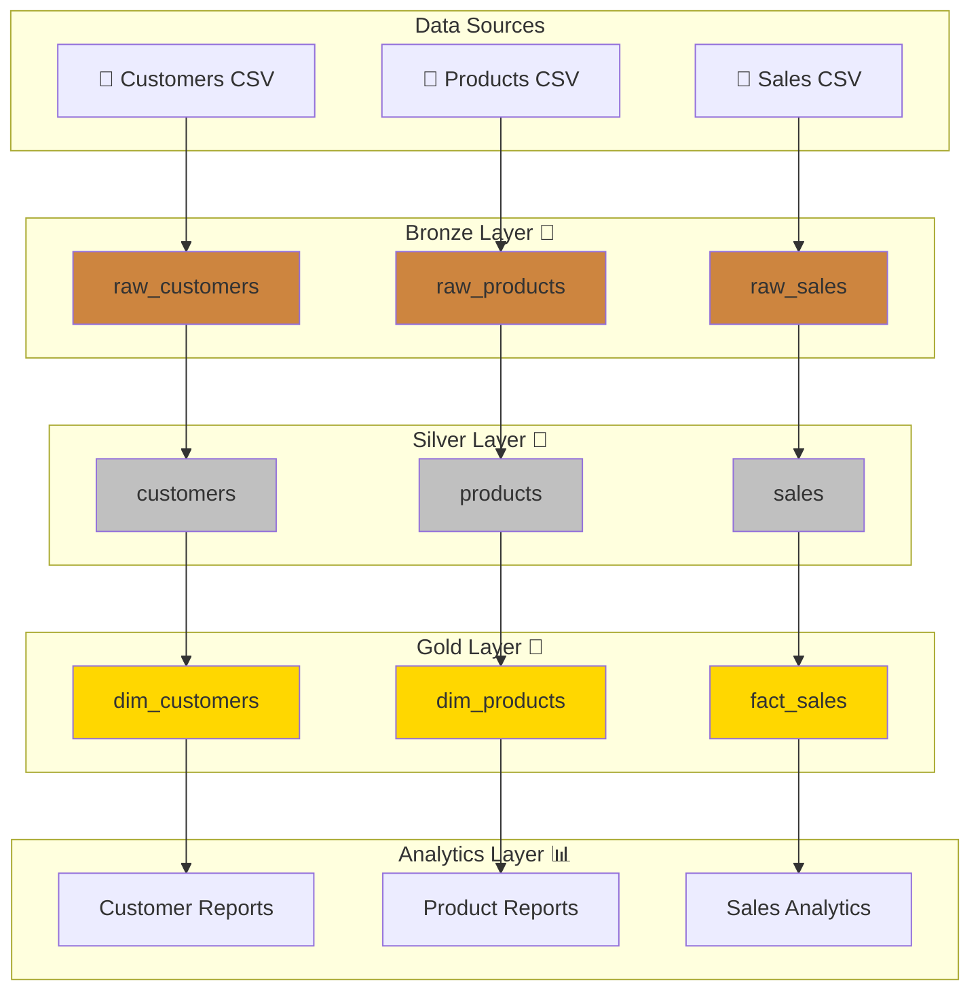
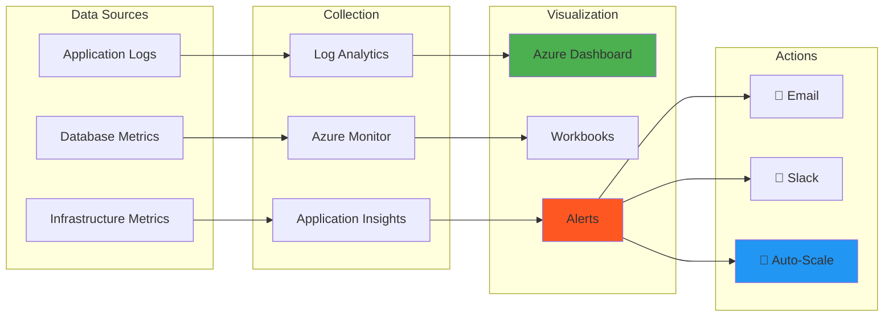

# 🏗️ System Architecture

## 🌐 High-Level Architecture



## 🏢 Container Architecture



## 🔄 Blue-Green Deployment Architecture



## 📊 Data Flow Architecture



## 🔐 Security Architecture

```mermaid
graph TB
    subgraph "Identity & Access"
        AAD[Azure AD]
        SP[Service Principal]
        RBAC[Role-Based Access]
    end
    
    subgraph "Secret Management"
        KV[Key Vault]
        GHS[GitHub Secrets]
        ENV[Environment Variables]
    end
    
    subgraph "Network Security"
        NSG[Network Security Groups]
        PE[Private Endpoints]
        FW[Azure Firewall]
    end
    
    subgraph "Data Security"
        TDE[Transparent Data Encryption]
        MASK[Dynamic Data Masking]
        AUDIT[SQL Audit]
    end
    
    AAD --> SP
    SP --> RBAC
    
    KV --> GHS
    GHS --> ENV
    
    NSG --> PE
    PE --> FW
    
    TDE --> MASK
    MASK --> AUDIT
    
    style AAD fill:#4CAF50
    style KV fill:#FF9800
    style NSG fill:#2196F3
    style TDE fill:#9C27B0
```



## 🚀 Deployment Pipeline Architecture

```mermaid
gitgraph
    commit id: "Initial"
    branch blue
    checkout blue
    commit id: "Deploy Blue"
    commit id: "Test Blue"
    checkout main
    merge blue
    commit id: "Blue Live"
    
    branch green
    checkout green
    commit id: "Deploy Green"
    commit id: "Test Green"
    commit id: "Switch Traffic"
    checkout main
    merge green
    commit id: "Green Live"
    
    branch hotfix
    checkout hotfix
    commit id: "Rollback Blue"
    checkout main
    merge hotfix
    commit id: "Blue Restored"
```

## 📈 Monitoring Architecture

