# 🚀 Blue-Green Deployment Guide

## 🎯 Quick Start

### One-Click Deployment
```bash
# 1. Deploy to blue environment
./deploy.sh blue deploy

# 2. Switch traffic to green
./deploy.sh green switch

# 3. Rollback if needed
./deploy.sh blue rollback
```

## 🔄 Deployment Process

### Phase 1: Environment Preparation


### Phase 2: Data Loading & Testing

```mermaid
sequenceDiagram
    participant GH as GitHub Actions
    participant DB as Database
    participant S as Storage
    participant Test as Tests
    
    GH->>S: Upload CSV Files
    S->>DB: Load Data (Bronze→Silver→Gold)
    DB->>Test: Run Quality Tests
    Test->>GH: Validation Results
```


### Phase 3: Traffic Switching


## 🛡️ Security Features

### 🔐 Secret Management
- **Key Vault Integration**: All secrets stored securely
- **Temporary Files**: Connection strings in restricted files
- **Automatic Cleanup**: Secrets removed after use
- **No Exposure**: Secrets never appear in logs

### 🔍 Security Scanning


## 📊 Monitoring & Alerts

### Health Check Dashboard

```mermaid
graph TD
    A[Health Checks] --> B[Database Status]
    A --> C[Application Gateway]
    A --> D[Storage Account]
    
    B --> E[Alert if Down]
    C --> E
    D --> E
    
    E --> F[📧 Email Notification]
    E --> G[📱 Slack Alert]
    
    style E fill:#FFD700
    style F fill:#87CEEB
    style G fill:#98FB98
```


## 🔧 Troubleshooting

### Common Issues
| Issue | Solution | Command |
|-------|----------|---------|
| 🔴 Deployment Failed | Check logs | `az monitor activity-log list` |
| 🟡 Health Check Failed | Verify database | `sqlcmd -S server -Q "SELECT 1"` |
| 🟠 Traffic Not Switching | Check gateway | `az network application-gateway show` |
| 🔵 Rollback Needed | Execute rollback | `./deploy.sh blue rollback` |

### Emergency Procedures
```bash
# Immediate rollback
./deploy.sh blue rollback

# Check deployment status
terraform output deployment_status

# View GitHub Actions logs
gh run list --workflow=deploy-pipeline.yml
```

## 📈 Performance Metrics

### Deployment KPIs
- ⚡ **Deployment Time**: < 10 minutes
- 🎯 **Success Rate**: > 99%
- ⏱️ **Rollback Time**: < 2 minutes
- 🔄 **Zero Downtime**: 100%

### Monitoring Queries
```sql
-- Check deployment health
SELECT 
    'Database Health' as metric,
    CASE WHEN COUNT(*) > 0 THEN 'Healthy' ELSE 'Unhealthy' END as status
FROM gold.fact_sales;

-- Verify data consistency
SELECT 
    TABLE_SCHEMA,
    COUNT(*) as table_count
FROM INFORMATION_SCHEMA.TABLES
WHERE TABLE_SCHEMA IN ('bronze', 'silver', 'gold')
GROUP BY TABLE_SCHEMA;
```